# Your Market

## Auction website Ebay like

School Project Year 3 (2020-2021)

``` To try out the projet import `loginSystem.sql` file into your database

Run Xampp or Mampp and put the projet files into the `htdocs`folder

Then go to localhost in your browser to try it out ! ```

#### Home page with options


#### Can signup a user through db as a seller or buyer account
#### Login user, has password validation
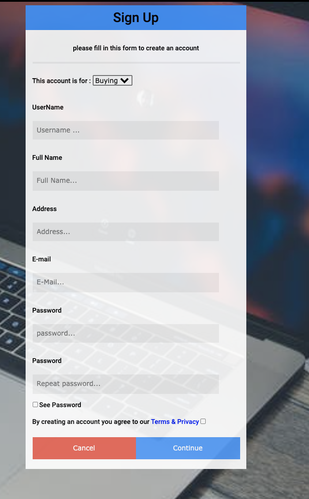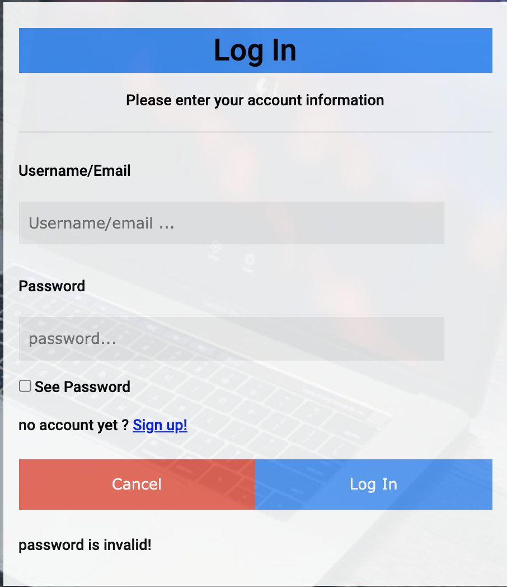

#### Buyer or Seller users will have different available options


#### Can see all items and browse through categories

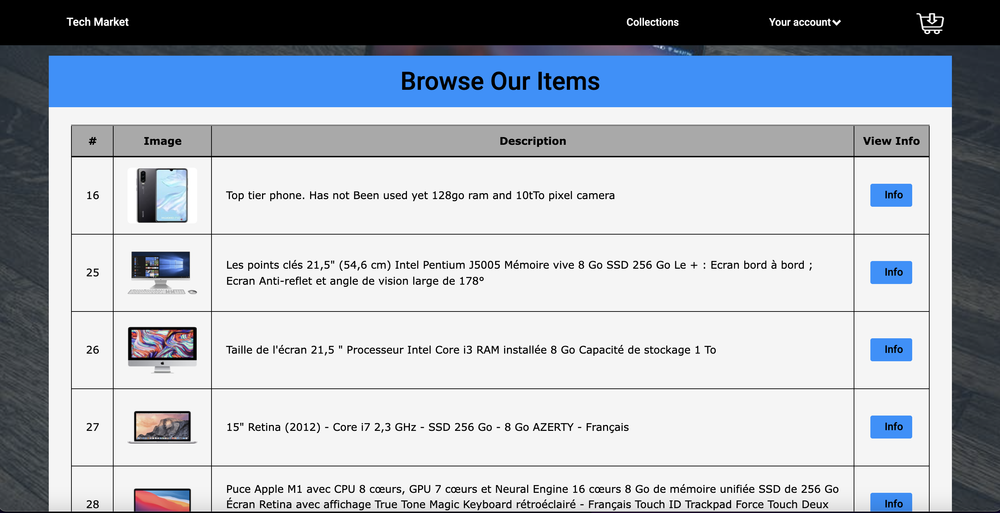
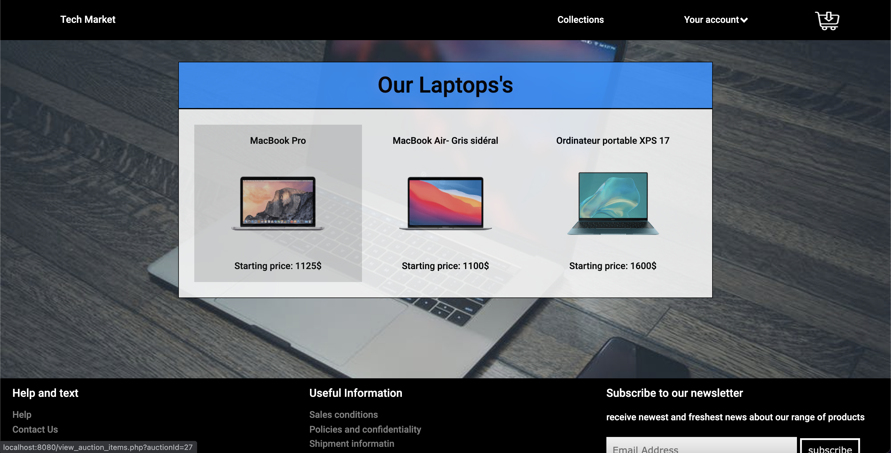

#### Can see Item Info and add it to basket

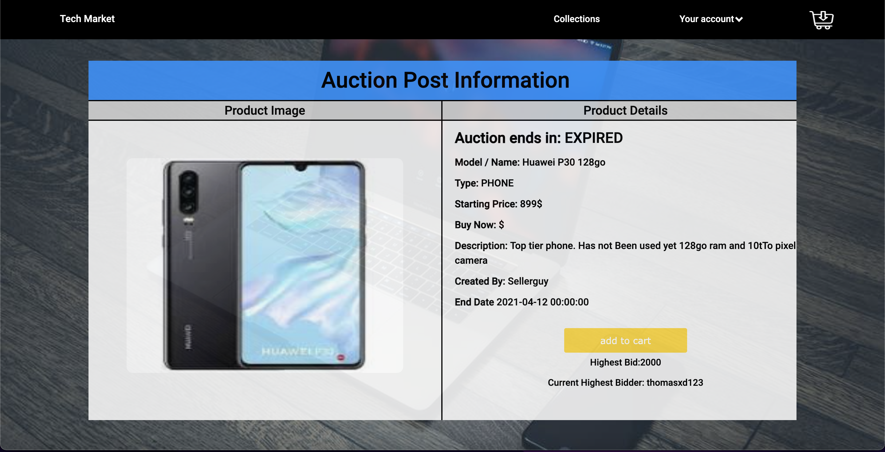

#### Can bid and buy from the basket

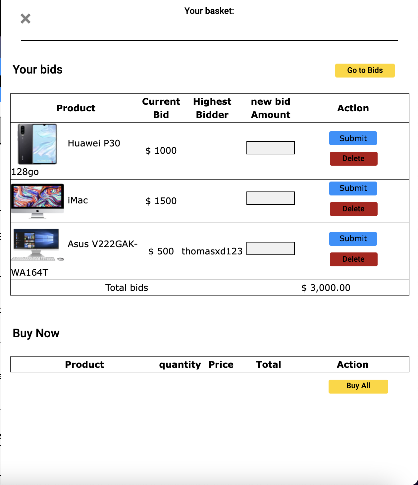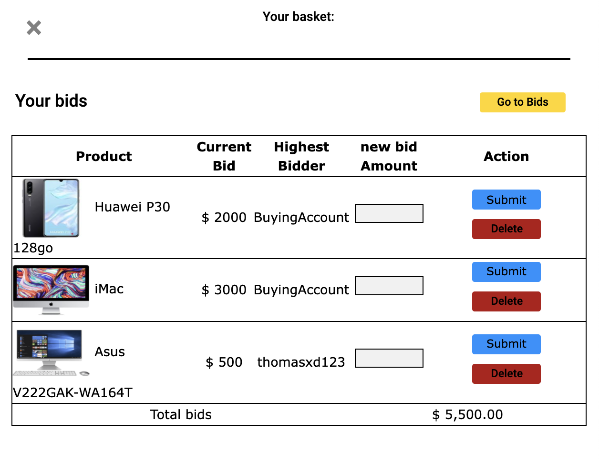

#### Seller Buyer and Admin Have their own profiles

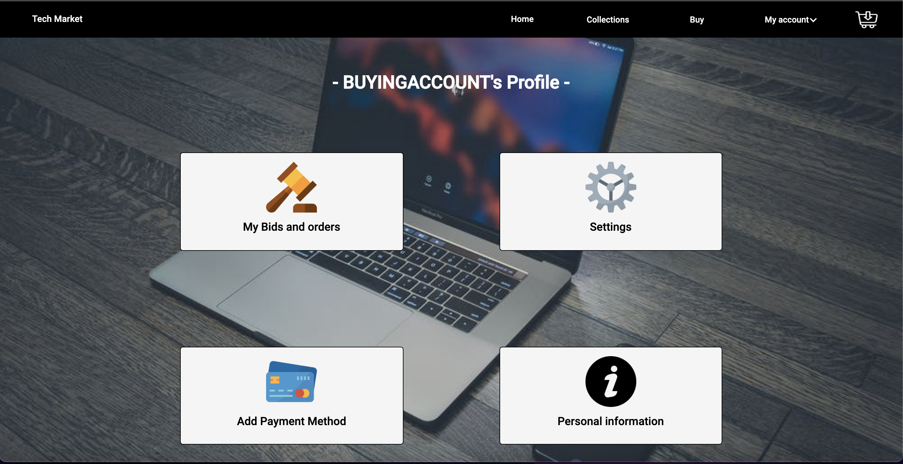

#### Seller Can Put items up for Sale

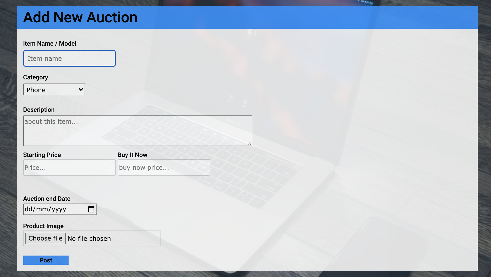

### Website Admin can Add Delete and Edit Users and Items

can only add Sellers and remove them he will no be able to affect buyers


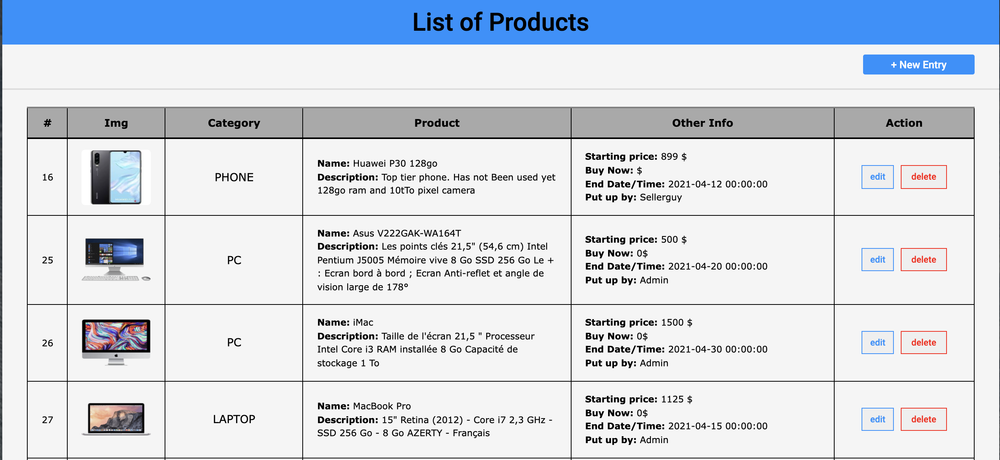
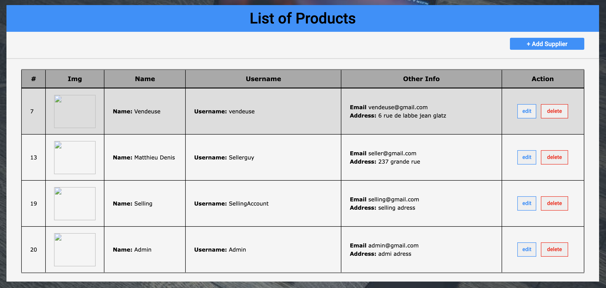

